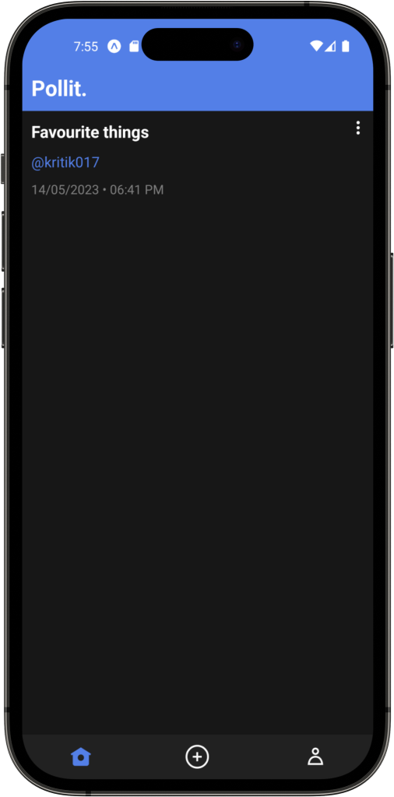
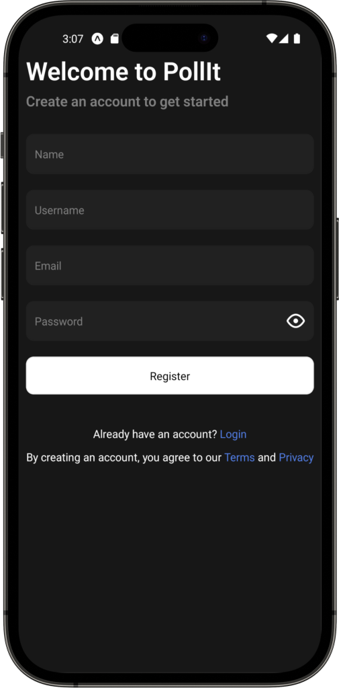
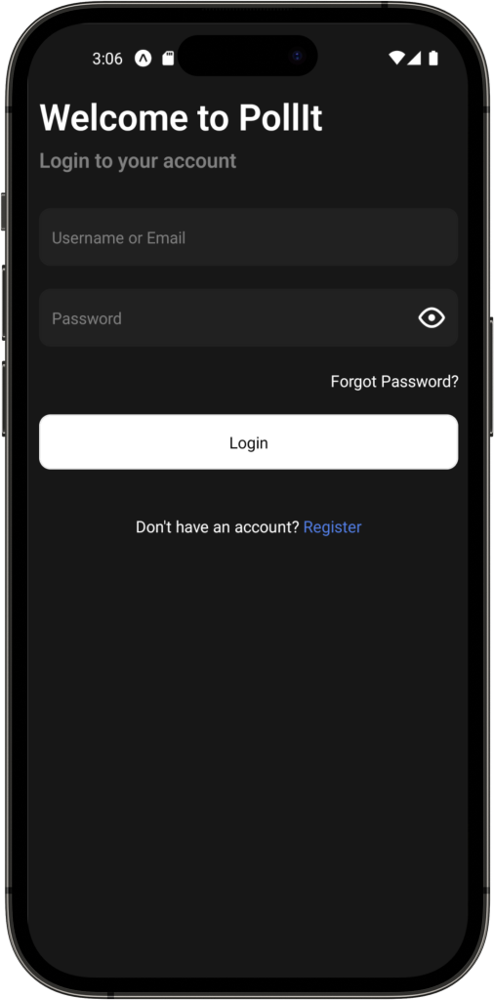
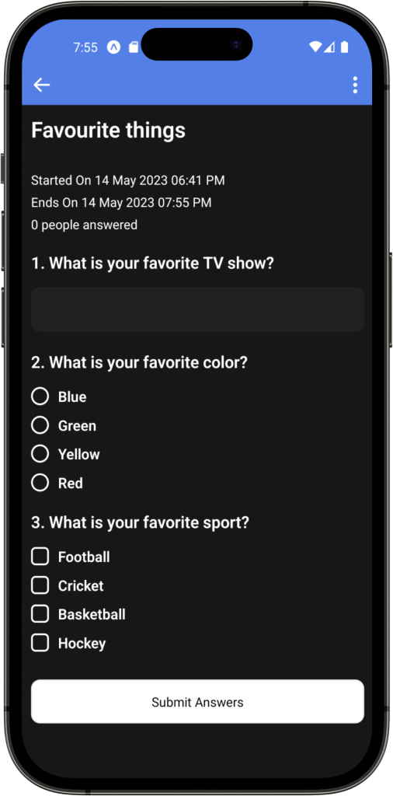

# PollIt App

Pollit is a simple polling app. It allows users to create polls and vote on them. The app is built with React Native, @reduxjs/toolkit, and Node.js and Typescript

The `app-mobile` directory contains all the React Native code for the app.

## App preview

---

### Home Page

<figure>

  
    <figcaption>Home Page</figcaption>

</figure>

This page contains all the polls that are available to the user. They can interact with them from here. It also provides the functionality for the user to create polls and the user can also visit their profile.

---

### Authentication Pages

<figure>

    
    <figcaption>Register Page</figcaption>

</figure>

The user can register for the application from this page. They need to provide their details and if properly validated, the user will be registered on the platform.

<figure>

  
    <figcaption>Login Page</figcaption>

</figure>

Registered users can log onto the application from this page. If not registered they can also redirect themselves to the registration page from here.

<figure>

  
    <figcaption>Forgot Password Page</figcaption>

</figure>

Users can reset their password from this page after OTP verification.

---

### Poll Pages

<figure>

  
    <figcaption>Create Poll Page</figcaption>

</figure>

The user can create a poll from this page. It provides an interface to select question types and their question. Answer can also be specified. Apart from questions, metadata about the poll like its title and validity can also be declared from here.

<figure>

  
    <figcaption>Vote Poll Page</figcaption>

</figure>

User can vote on polls from here and submit their answers.
